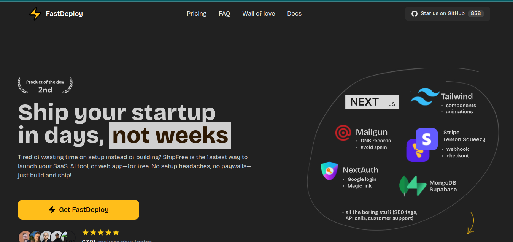

# ⚡ FastDeploy



#
O FastDeploy é um kit inicial moderno para fundadores e desenvolvedores que desejam construir e lançar rapidamente sem se prender a uma configuração complexa. Seja criando um SaaS, uma ferramenta de IA ou qualquer tipo de aplicativo web, o FastDeploy oferece tudo o que você precisa para transformar sua ideia em receita com o mínimo de atrito.

Desenvolvido com techologia moderna — incluindo Next.js, Supabase, Stripe, LemonSqueezy, Drizzle ORM e Mailgun — e vem totalmente equipado com recursos essenciais como autenticação, pagamentos, rotas de API protegidas, gerenciamento de e-mails e SEO.

## Features

- Otimização de SEO
- Autenticação de usuários com Supabase
- Integração com Stripe e LemonSqueezy
- Notificações por e-mail via Mailgun
- Interface de usuário moderna desenvolvida com Next.js e TailwindCSS

## Docker Setup

FastDeploy provides Docker configurations for both **development** and **production** environments. Below, you'll find the structure of the Docker files and the commands to get started.

### Docker File Structure

The Docker files are organized as follows:

```
docker
├── dev
│   ├── Dockerfile                  # Dockerfile for development
│   ├── docker-compose.yml          # Base development setup
│   ├── docker-compose.mongodb.yml  # Development setup with MongoDB
│   └── docker-compose.postgres.yml # Development setup with PostgreSQL
└── prod
    ├── Dockerfile                  # Dockerfile for production
    ├── docker-compose.yml          # Base production setup
    ├── docker-compose.mongodb.yml  # Production setup with MongoDB
    └── docker-compose.postgres.yml # Production setup with PostgreSQL
```

### Development Environment

In development, the project runs in **watch mode**, meaning it automatically detects changes in your code and rebuilds the application. This is ideal for local development but should **never** be used in production.

#### Commands for Development

1. **Base Setup** (without a database):

   ```bash
   docker-compose -f docker/dev/docker-compose.yml up --build
   ```

2. **With PostgreSQL**:

   ```bash
   docker-compose -f docker/dev/docker-compose.yml -f docker/dev/docker-compose.postgres.yml up --build
   ```

3. **With MongoDB**:
   ```bash
   docker-compose -f docker/dev/docker-compose.yml -f docker/dev/docker-compose.mongodb.yml up --build
   ```

#### Why Watch Mode?

- **Watch mode** ensures that your changes are reflected in real-time without manually restarting the server.
- It’s perfect for development but **not suitable for production** due to performance and security concerns.

---

### Production Environment

The production environment is optimized for performance and security. It uses a multi-stage build to reduce the image size and includes only the necessary dependencies.

#### Commands for Production

1. **Base Setup** (without a database):

   ```bash
   docker-compose -f docker/prod/docker-compose.yml up --build -d
   ```

2. **With PostgreSQL**:

   ```bash
   docker-compose -f docker/prod/docker-compose.yml -f docker/prod/docker-compose.postgres.yml up --build -d
   ```

3. **With MongoDB**:
   ```bash
   docker-compose -f docker/prod/docker-compose.yml -f docker/prod/docker-compose.mongodb.yml up --build -d
   ```

#### Key Differences in Production

- **No watch mode**: The application is pre-built, and changes require a rebuild.
- **Optimized images**: Smaller image size and faster startup times.
- **Environment variables**: Ensure all required variables (e.g., `DATABASE_URL`, `API_KEY`) are set.

---

### Portainer Integration

Portainer is included in both development and production setups to help you manage your Docker containers via a web interface.

- **Access Portainer**: `http://localhost:9000`
- **Default credentials**: Set up during the first login.

---

### Disclaimer

- **Development Mode**: Uses watch mode for real-time updates. Not suitable for production.
- **Production Mode**: Optimized for performance and security. Requires a rebuild for changes.

---

## Docs

For full documentation, visit: [FastDeploy Docs](https://FastDeploy.idee8.agency/docs)

## Code of Conduct

Please read our [Code of Conduct](CODE_OF_CONDUCT.md) before contributing.

## Contributing

For people who want to contribute, please refer to [CONTRIBUTING.md](CONTRIBUTING.md).

---

Cooked for you with ❤️ by [Joao Marcos Jova](https://Kadoshsoftwares.com)
